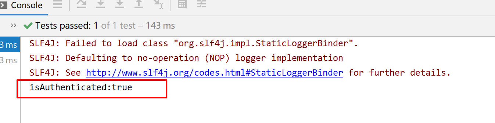

## Shiro认证


搭建测试环境引入依赖：

```java
<dependencies>
    <!--shiro核心依赖-->
    <dependency>
        <groupId>org.apache.shiro</groupId>
        <artifactId>shiro-core</artifactId>
        <version>1.4.0</version>
    </dependency>
    <!--单元测试-->
    <dependency>
        <groupId>junit</groupId>
        <artifactId>junit</artifactId>
        <version>RELEASE</version>
    </dependency>
</dependencies>
```

编写测试类：

```java
package com.lb.test;

import jdk.nashorn.internal.ir.CallNode;
import org.apache.shiro.SecurityUtils;
import org.apache.shiro.authc.UsernamePasswordToken;
import org.apache.shiro.mgt.DefaultSecurityManager;
import org.apache.shiro.realm.SimpleAccountRealm;
import org.apache.shiro.subject.Subject;
import org.junit.Before;
import org.junit.Test;

public class AuthenticationTest {

    SimpleAccountRealm  simpleAccountRealm= new SimpleAccountRealm();

    //Before可以理解为事先，After理解为事后
    @Before
    public void addUser(){
        simpleAccountRealm.addAccount("Mark","123456");
    }

    @Test
    public void testAuthentication(){
        //1.构建SecurityManager环境
        DefaultSecurityManager defaultSecurityManager = new DefaultSecurityManager();
        defaultSecurityManager.setRealm(simpleAccountRealm);

        //2.主体提交认证请求
        SecurityUtils.setSecurityManager(defaultSecurityManager);
        Subject subject = SecurityUtils.getSubject();

        UsernamePasswordToken token = new UsernamePasswordToken("Mark", "123456");
        subject.login(token);

        //subject.isAuthenticated();
        System.out.println("isAuthenticated:"+subject.isAuthenticated());

        //退出
        subject.logout();

        System.out.println("isAuthenticated:"+subject.isAuthenticated());


    }
}
```

测试：

账号密码相同打印认证成功


密码不同时报错：


## Shiro授权


```Java
package com.lb.test;

import jdk.nashorn.internal.ir.CallNode;
import org.apache.shiro.SecurityUtils;
import org.apache.shiro.authc.UsernamePasswordToken;
import org.apache.shiro.mgt.DefaultSecurityManager;
import org.apache.shiro.realm.SimpleAccountRealm;
import org.apache.shiro.subject.Subject;
import org.junit.Before;
import org.junit.Test;

public class AuthenticationTest {

    SimpleAccountRealm  simpleAccountRealm= new SimpleAccountRealm();

    //Before可以理解为事先，After理解为事后
    @Before
    public void addUser(){
        simpleAccountRealm.addAccount("Mark","123456","admin");
    }

    @Test
    public void testAuthentication(){
        //1.构建SecurityManager环境
        DefaultSecurityManager defaultSecurityManager = new DefaultSecurityManager();
        defaultSecurityManager.setRealm(simpleAccountRealm);

        //2.主体提交认证请求
        SecurityUtils.setSecurityManager(defaultSecurityManager);
        Subject subject = SecurityUtils.getSubject();

        UsernamePasswordToken token = new UsernamePasswordToken("Mark", "123456");
        subject.login(token);

        //subject.isAuthenticated();
        System.out.println("isAuthenticated:"+subject.isAuthenticated());

        subject.checkRole("admin");

        //退出
        //subject.logout();

        //System.out.println("isAuthenticated:"+subject.isAuthenticated());


    }
}
```

添加一个角色字符


`subject.checkRole()`判断是否拥有该角色,不拥有会报错


## IniRealm讲解 

增加user.ini文件


```Java
package com.lb.test;

import org.apache.shiro.SecurityUtils;
import org.apache.shiro.authc.UsernamePasswordToken;
import org.apache.shiro.mgt.DefaultSecurityManager;
import org.apache.shiro.realm.text.IniRealm;
import org.apache.shiro.subject.Subject;
import org.junit.Test;

public class IniRealmTest {
    @Test
    public void testAuthentication(){

        IniRealm iniRealm = new IniRealm("classpath:user.ini");

        //1.构建SecurityManager环境
        DefaultSecurityManager defaultSecurityManager = new DefaultSecurityManager();
        defaultSecurityManager.setRealm(iniRealm);

        //2.主体提交认证请求
        SecurityUtils.setSecurityManager(defaultSecurityManager);
        Subject subject = SecurityUtils.getSubject();

        UsernamePasswordToken token = new UsernamePasswordToken("Mark", "123456");
        subject.login(token);

        System.out.println("isAuthenticated:"+subject.isAuthenticated());

        //是否有拥有admin角色，没有就报错
        subject.checkRole("admin");

        //是否有拥有user:delete权限，没有就报错
        subject.checkPermission("user:delete");
    }
}
```

## JDBCRealm讲解

添加数据库相关依赖

```java
<!--mysql驱动包-->
<dependency>
    <groupId>mysql</groupId>
    <artifactId>mysql-connector-java</artifactId>
    <version>8.0.19</version>
</dependency>

<!--数据源-->
<dependency>
    <groupId>com.alibaba</groupId>
    <artifactId>druid</artifactId>
    <version>1.1.6</version>
</dependency>
```

创建表：

```sql
/*
 Navicat Premium Data Transfer

 Source Server         : localhost
 Source Server Type    : MySQL
 Source Server Version : 80019
 Source Host           : localhost:3306
 Source Schema         : test

 Target Server Type    : MySQL
 Target Server Version : 80019
 File Encoding         : 65001

 Date: 31/05/2020 16:10:31
*/

SET NAMES utf8mb4;
SET FOREIGN_KEY_CHECKS = 0;

-- ----------------------------
-- Table structure for roles_permissions
-- ----------------------------
DROP TABLE IF EXISTS `roles_permissions`;
CREATE TABLE `roles_permissions`  (
  `id` int(0) NOT NULL AUTO_INCREMENT,
  `role_name` varchar(255) CHARACTER SET utf8mb4 COLLATE utf8mb4_0900_ai_ci NULL DEFAULT NULL,
  `permission` varchar(255) CHARACTER SET utf8mb4 COLLATE utf8mb4_0900_ai_ci NULL DEFAULT NULL,
  PRIMARY KEY (`id`) USING BTREE
) ENGINE = InnoDB CHARACTER SET = utf8mb4 COLLATE = utf8mb4_0900_ai_ci ROW_FORMAT = Dynamic;

-- ----------------------------
-- Records of roles_permissions
-- ----------------------------
INSERT INTO `roles_permissions` VALUES (1, 'admin', 'user:select');

-- ----------------------------
-- Table structure for test_user
-- ----------------------------
DROP TABLE IF EXISTS `test_user`;
CREATE TABLE `test_user`  (
  `id` int(0) NOT NULL AUTO_INCREMENT,
  `user_name` varchar(255) CHARACTER SET utf8mb4 COLLATE utf8mb4_0900_ai_ci NULL DEFAULT NULL,
  `password` varchar(255) CHARACTER SET utf8mb4 COLLATE utf8mb4_0900_ai_ci NULL DEFAULT NULL,
  PRIMARY KEY (`id`) USING BTREE
) ENGINE = InnoDB CHARACTER SET = utf8mb4 COLLATE = utf8mb4_0900_ai_ci ROW_FORMAT = Dynamic;

-- ----------------------------
-- Records of test_user
-- ----------------------------
INSERT INTO `test_user` VALUES (1, 'xiaoming', '123456');

-- ----------------------------
-- Table structure for user_roles
-- ----------------------------
DROP TABLE IF EXISTS `user_roles`;
CREATE TABLE `user_roles`  (
  `id` int(0) NOT NULL AUTO_INCREMENT,
  `username` varchar(255) CHARACTER SET utf8mb4 COLLATE utf8mb4_0900_ai_ci NULL DEFAULT NULL,
  `role_name` varchar(255) CHARACTER SET utf8mb4 COLLATE utf8mb4_0900_ai_ci NULL DEFAULT NULL,
  PRIMARY KEY (`id`) USING BTREE
) ENGINE = InnoDB CHARACTER SET = utf8mb4 COLLATE = utf8mb4_0900_ai_ci ROW_FORMAT = Dynamic;

-- ----------------------------
-- Records of user_roles
-- ----------------------------
INSERT INTO `user_roles` VALUES (1, 'Mark', 'admin');
INSERT INTO `user_roles` VALUES (2, 'Mark', 'user');

-- ----------------------------
-- Table structure for users
-- ----------------------------
DROP TABLE IF EXISTS `users`;
CREATE TABLE `users`  (
  `id` int(0) NOT NULL AUTO_INCREMENT,
  `username` varchar(255) CHARACTER SET utf8mb4 COLLATE utf8mb4_0900_ai_ci NULL DEFAULT NULL,
  `password` varchar(255) CHARACTER SET utf8mb4 COLLATE utf8mb4_0900_ai_ci NULL DEFAULT NULL,
  PRIMARY KEY (`id`) USING BTREE
) ENGINE = InnoDB CHARACTER SET = utf8mb4 COLLATE = utf8mb4_0900_ai_ci ROW_FORMAT = Dynamic;

-- ----------------------------
-- Records of users
-- ----------------------------
INSERT INTO `users` VALUES (1, 'Mark', '123456');

SET FOREIGN_KEY_CHECKS = 1;

```

测试：


```java
package com.lb.test;

import com.alibaba.druid.pool.DruidDataSource;
import jdk.nashorn.internal.ir.CallNode;
import org.apache.shiro.SecurityUtils;
import org.apache.shiro.authc.UsernamePasswordToken;
import org.apache.shiro.mgt.DefaultSecurityManager;
import org.apache.shiro.realm.jdbc.JdbcRealm;
import org.apache.shiro.realm.text.IniRealm;
import org.apache.shiro.subject.Subject;
import org.junit.Test;

public class JDBCRealmTest {

    DruidDataSource druidDataSource = new DruidDataSource();
    {
        druidDataSource.setUrl("jdbc:mysql://127.0.0.1:3306/test?useUnicode=true&characterEncoding=utf8&zeroDateTimeBehavior=convertToNull&useSSL=true&serverTimezone=GMT%2B8");
        druidDataSource.setUsername("root");
        druidDataSource.setPassword("123456");
    }

    @Test
    public void testAuthentication(){

        JdbcRealm jdbcRealm = new JdbcRealm();
        jdbcRealm.setDataSource(druidDataSource);
        //打开权限开关
        jdbcRealm.setPermissionsLookupEnabled(true);

        //使用自定义的sql查询用户
        String sql = "select password from test_user where user_name = ?";
        jdbcRealm.setAuthenticationQuery(sql);

        //1.构建SecurityManager环境
        DefaultSecurityManager defaultSecurityManager = new DefaultSecurityManager();
        defaultSecurityManager.setRealm(jdbcRealm);

        //2.主体提交认证请求
        SecurityUtils.setSecurityManager(defaultSecurityManager);
        Subject subject = SecurityUtils.getSubject();

        UsernamePasswordToken token = new UsernamePasswordToken("Mark", "123456");
        subject.login(token);

        System.out.println("isAuthenticated:"+subject.isAuthenticated());

        //是否有拥有admin角色，没有就报错
        //subject.checkRole("admin");

        //是否有拥有admin和user角色，没有就报错
        //subject.checkRoles("admin","user");

        //是否有拥有user:delete权限，没有就报错
        //subject.checkPermission("user:select");
    }
}
```


为什么我们没有写sql语句也可以验证账号密码，因为使用了jdbcRealm默认的sql语句


另外我们也可以自定义sql


## 自定义Realm

### 认证：

创建CustomRealm类继承AuthorizingRealm实现自定义Rralm

```java
package com.lb.shiro.realm;

import jdk.nashorn.internal.ir.CallNode;
import org.apache.shiro.authc.AuthenticationException;
import org.apache.shiro.authc.AuthenticationInfo;
import org.apache.shiro.authc.AuthenticationToken;
import org.apache.shiro.authc.SimpleAuthenticationInfo;
import org.apache.shiro.authz.AuthorizationInfo;
import org.apache.shiro.realm.AuthorizingRealm;
import org.apache.shiro.subject.PrincipalCollection;

import java.util.HashMap;
import java.util.Map;

public class CustomRealm extends AuthorizingRealm {

    Map<String,String> userMap = new HashMap<>(16);
    {
        userMap.put("Mark","123456");
    }

    /**
     * 授权
     * @param principalCollection
     * @return
     */
    @Override
    protected AuthorizationInfo doGetAuthorizationInfo(PrincipalCollection principalCollection) {
        return null;
    }

    /**
     * 登录认证
     * @param authenticationToken
     * @return
     * @throws AuthenticationException
     */
    @Override
    protected AuthenticationInfo doGetAuthenticationInfo(AuthenticationToken authenticationToken) throws AuthenticationException {
        //1.从主体传过来的认证信息中获取用户名
        String userName = (String)authenticationToken.getPrincipal();

        //2.通过用户名到数据库中获取凭证
        String password = getPasswordByUserName(userName);

        if(password == null){
            return null;
        }

        /**
         * 参数1：数据库查询到的userName
         * 参数2：数据库查询到的password
         * 参数3：该类的类名，可以使用this.getClass().getName()获得
         */
        SimpleAuthenticationInfo simpleAuthenticationInfo = new SimpleAuthenticationInfo(userName,password,this.getClass().getName());

        return simpleAuthenticationInfo;
    }

    //模拟访问数据库
    private String getPasswordByUserName(String userName) {
        return userMap.get(userName);
    }
}

```

测试认证：

```java
package com.lb.test;

import com.lb.shiro.realm.CustomRealm;
import org.apache.shiro.SecurityUtils;
import org.apache.shiro.authc.UsernamePasswordToken;
import org.apache.shiro.mgt.DefaultSecurityManager;
import org.apache.shiro.realm.jdbc.JdbcRealm;
import org.apache.shiro.subject.Subject;
import org.junit.Test;

public class CustomRealmTest {
    @Test
    public void testAuthentication(){
        CustomRealm customRealm = new CustomRealm();
        //1.构建SecurityManager环境
        DefaultSecurityManager defaultSecurityManager = new DefaultSecurityManager();
        defaultSecurityManager.setRealm(customRealm);

        //2.主体提交认证请求
        SecurityUtils.setSecurityManager(defaultSecurityManager);
        Subject subject = SecurityUtils.getSubject();

        UsernamePasswordToken token = new UsernamePasswordToken("Mark", "123456");
        subject.login(token);

        System.out.println("isAuthenticated:"+subject.isAuthenticated());
    }
}
```

### 授权：

```java
package com.lb.shiro.realm;

import jdk.nashorn.internal.ir.CallNode;
import org.apache.shiro.authc.AuthenticationException;
import org.apache.shiro.authc.AuthenticationInfo;
import org.apache.shiro.authc.AuthenticationToken;
import org.apache.shiro.authc.SimpleAuthenticationInfo;
import org.apache.shiro.authz.AuthorizationInfo;
import org.apache.shiro.authz.SimpleAuthorizationInfo;
import org.apache.shiro.realm.AuthorizingRealm;
import org.apache.shiro.subject.PrincipalCollection;

import java.util.HashMap;
import java.util.HashSet;
import java.util.Map;
import java.util.Set;

public class CustomRealm extends AuthorizingRealm {

    Map<String,String> userMap = new HashMap<>(16);
    {
        userMap.put("Mark","123456");
    }

    /**
     * 授权
     * @param principalCollection
     * @return
     */
    @Override
    protected AuthorizationInfo doGetAuthorizationInfo(PrincipalCollection principalCollection) {
        //获取用户信息
        String userName =(String) principalCollection.getPrimaryPrincipal();
        //根据用户信息获取用户拥有的角色
        Set<String> roles  = getRolesByUserName(userName);
        //根据用户信息获取用户拥有的权限
        Set<String> permissions = getPermissionsByUsername(userName);
        SimpleAuthorizationInfo simpleAuthorizationInfo = new SimpleAuthorizationInfo();
        //添加权限
        simpleAuthorizationInfo.setStringPermissions(permissions);
        //添加角色
        simpleAuthorizationInfo.setRoles(roles);
        return simpleAuthorizationInfo;
    }

    private Set<String> getPermissionsByUsername(String userName) {
        Set<String> sets = new HashSet<>();
        sets.add("user:delete");
        sets.add("user:add");
        return sets;
    }

    private Set<String> getRolesByUserName(String userName) {
        Set<String> sets = new HashSet<>();
        sets.add("admin");
        return sets;
    }

    /**
     * 登录认证
     * @param authenticationToken
     * @return
     * @throws AuthenticationException
     */
    @Override
    protected AuthenticationInfo doGetAuthenticationInfo(AuthenticationToken authenticationToken) throws AuthenticationException {
        //1.从主体传过来的认证信息中获取用户名
        String userName = (String)authenticationToken.getPrincipal();

        //2.通过用户名到数据库中获取凭证
        String password = getPasswordByUserName(userName);

        if(password == null){
            return null;
        }

        /**
         * 参数1：数据库查询到的userName
         * 参数2：数据库查询到的password
         * 参数3：该类的类名，可以使用this.getClass().getName()获得
         */
        SimpleAuthenticationInfo simpleAuthenticationInfo = new SimpleAuthenticationInfo(userName,password,this.getClass().getName());

        return simpleAuthenticationInfo;
    }

    //模拟访问数据库
    private String getPasswordByUserName(String userName) {
        return userMap.get(userName);
    }
}
```

测试：

```java
package com.lb.test;

import com.lb.shiro.realm.CustomRealm;
import org.apache.shiro.SecurityUtils;
import org.apache.shiro.authc.UsernamePasswordToken;
import org.apache.shiro.mgt.DefaultSecurityManager;
import org.apache.shiro.realm.jdbc.JdbcRealm;
import org.apache.shiro.subject.Subject;
import org.junit.Test;

public class CustomRealmTest {
    @Test
    public void testAuthentication(){
        CustomRealm customRealm = new CustomRealm();
        //1.构建SecurityManager环境
        DefaultSecurityManager defaultSecurityManager = new DefaultSecurityManager();
        defaultSecurityManager.setRealm(customRealm);

        //2.主体提交认证请求
        SecurityUtils.setSecurityManager(defaultSecurityManager);
        Subject subject = SecurityUtils.getSubject();

        UsernamePasswordToken token = new UsernamePasswordToken("Mark", "123456");
        subject.login(token);

        System.out.println("isAuthenticated:"+subject.isAuthenticated());

        //是否有拥有admin角色，没有就报错
        subject.checkRole("admin");

        //是否有拥有user:delete权限，没有就报错
        subject.checkPermission("user:delete");
    }
}
```

## Shiro加密

`HashedCredentialsMatcher`设置加密放入自定义的Realm中


```Java
package com.lb.test;

import com.lb.shiro.realm.CustomRealm;
import org.apache.shiro.SecurityUtils;
import org.apache.shiro.authc.UsernamePasswordToken;
import org.apache.shiro.authc.credential.HashedCredentialsMatcher;
import org.apache.shiro.mgt.DefaultSecurityManager;
import org.apache.shiro.realm.jdbc.JdbcRealm;
import org.apache.shiro.subject.Subject;
import org.junit.Test;

public class CustomRealmTest {
    @Test
    public void testAuthentication(){
        CustomRealm customRealm = new CustomRealm();
        //1.构建SecurityManager环境
        DefaultSecurityManager defaultSecurityManager = new DefaultSecurityManager();
        defaultSecurityManager.setRealm(customRealm);

        // 加密
        HashedCredentialsMatcher matcher = new HashedCredentialsMatcher();
        // 加密算法名称
        matcher.setHashAlgorithmName("md5");
        // 加密次数
        matcher.setHashIterations(1);
        // 自定义 Realm 中设置加密对象
        customRealm.setCredentialsMatcher(matcher);

        //2.主体提交认证请求
        SecurityUtils.setSecurityManager(defaultSecurityManager);
        Subject subject = SecurityUtils.getSubject();

        UsernamePasswordToken token = new UsernamePasswordToken("Mark", "123456");
        subject.login(token);

        System.out.println("isAuthenticated:"+subject.isAuthenticated());

    }
}
```

获取123456加密之后的结果


模拟密码改为加密之后的


测试：加密后更够重新登录



### 继续加盐：

在自定义的Realm登录认证中加盐


测试：发现密码错误，因为我们没有把模拟数据库的密码加盐


获取加盐后的密码：


模拟数据的密码为加盐后的


测试，验证成功


## 总结

### 写一个类继承AuthorizingRealm自定义Realm，重写授权方法和登录认证方法