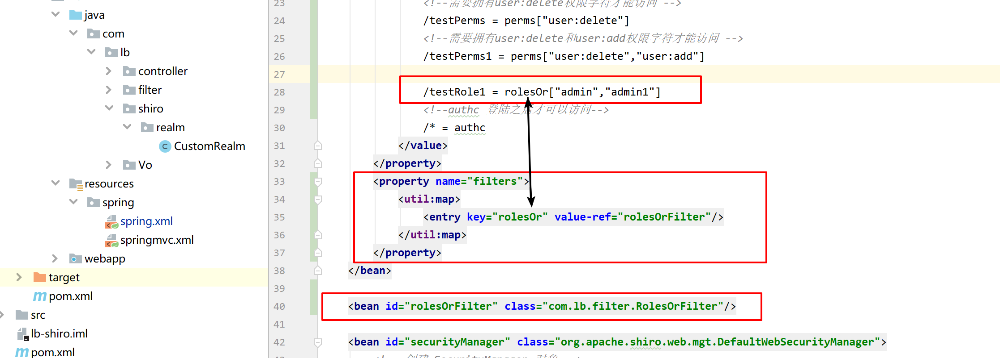

## 4-1Shiro集成spring

见代码

## 4-2Shiro集成Spring-从数据库获取数据

略

## 4-3Shiro通过注解配置授权

@RequiresRoles("admin")//表示需要admin角色才可以访问

@RequiresPermissions("user:add")//表示需要拥有user:add权限字符才可以访问


## 4-4Shiro过滤器

### Shiro内置过滤器（filter）


添加几个测试接口

```java
@RequestMapping(value = "/testRole", method = RequestMethod.GET)
@ResponseBody
public String testRole() {
    return "testRole success";
}

@RequestMapping(value = "/testRole1", method = RequestMethod.GET)
@ResponseBody
public String testRole1() {
    return "testRole1 success";
}

@RequestMapping(value = "/testPerms", method = RequestMethod.GET)
@ResponseBody
public String testPerms() {
    return "testPerms success";
}

@RequestMapping(value = "/testPerms1", method = RequestMethod.GET)
@ResponseBody
public String testPerms1() {
    return "testPerms1 success";
}
```

配置接口权限


### 自定义 filter（过滤器）：如果传多个 roles 满足任何一个即可

写一个类继承AuthorizationFilter


把这个类放入spring容器，并添加到shiroFilter中

