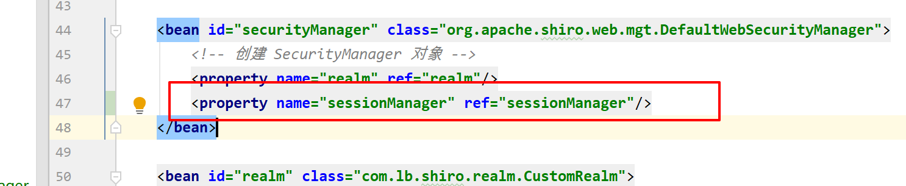
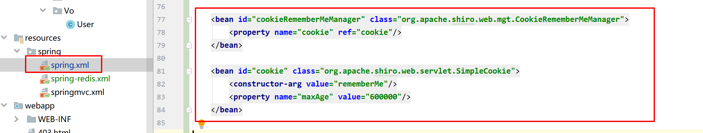

## 5-1Shiro会话管理


添加依赖

```java
<dependency>
    <groupId>redis.clients</groupId>
    <artifactId>jedis</artifactId>
    <version>2.9.0</version>
</dependency>
```

### 创建一个类继承AbstractSessionDAO并重写方法

```java
package com.lb.session;

import org.apache.shiro.session.Session;
import org.apache.shiro.session.UnknownSessionException;
import org.apache.shiro.session.mgt.eis.AbstractSessionDAO;

import java.io.Serializable;
import java.util.Collection;

public class RedisSessionDao extends AbstractSessionDAO {

    @Override
    protected Serializable doCreate(Session session) {
        return null;
    }

    @Override
    protected Session doReadSession(Serializable serializable) {
        return null;
    }

    @Override
    public void update(Session session) throws UnknownSessionException {

    }

    @Override
    public void delete(Session session) {

    }

    @Override
    public Collection<Session> getActiveSessions() {
        return null;
    }
}
```

创建JedisUtil


```
package com.lb.Util;

import org.springframework.beans.factory.annotation.Autowired;
import org.springframework.stereotype.Component;
import redis.clients.jedis.Jedis;
import redis.clients.jedis.JedisPool;

import java.util.Set;


@Component
public class JedisUtil {

    @Autowired
    private JedisPool jedisPool;

    private JedisUtil() {
    }

    public void set(byte[] key, byte[] value) {
        try (Jedis jedis = getResource()) {
            jedis.set(key, value);
        }
    }

    public void expire(byte[] key, int expireTime) {
        try (Jedis jedis = getResource()) {
            jedis.expire(key, expireTime);
        }
    }

    private Jedis getResource() {
        return jedisPool.getResource();
    }

    public byte[] get(byte[] key) {
        try (Jedis jedis = getResource()) {
            return jedis.get(key);
        }
    }

    public void delete(byte[] key) {
        try (Jedis jedis = getResource()) {
            jedis.del(key);
        }
    }

    public Set<byte[]> keys(String prefix) {
        try (Jedis jedis = getResource()) {
            return jedis.keys((prefix + "*").getBytes());
        }
    }
}

```

添加注解扫描，不然这个注解不起作用


创建jedisPool


```xml
<?xml version="1.0" encoding="UTF-8"?>
<beans xmlns="http://www.springframework.org/schema/beans"
       xmlns:xsi="http://www.w3.org/2001/XMLSchema-instance"
       xsi:schemaLocation="http://www.springframework.org/schema/beans http://www.springframework.org/schema/beans/spring-beans.xsd">

    <bean id="jedisPool" class="redis.clients.jedis.JedisPool">
        <constructor-arg name="poolConfig" ref="jedisPoolConfig"/>
        <constructor-arg name="host" value="127.0.0.1"/>
        <constructor-arg name="port" value="6379"/>
        <constructor-arg name="timeout" value="100000"/>
    </bean>

    <bean id="jedisPoolConfig" class="redis.clients.jedis.JedisPoolConfig"/>
</beans>
```

引入spring-redis配置、添加注解扫描


重写AbstractSessionDAO

```java
package com.lb.session;

import com.lb.Util.JedisUtil;
import org.apache.commons.collections.CollectionUtils;
import org.apache.shiro.session.Session;
import org.apache.shiro.session.UnknownSessionException;
import org.apache.shiro.session.mgt.eis.AbstractSessionDAO;
import org.springframework.util.SerializationUtils;

import javax.annotation.Resource;
import java.io.Serializable;
import java.util.Collection;
import java.util.HashSet;
import java.util.Set;

public class RedisSessionDao extends AbstractSessionDAO {

    @Resource
    private JedisUtil jedisUtil;

    private final String SHIRO_SESSION_PREFIX = "cheng-session:";

    private byte[] getKey(String key) {
        return (SHIRO_SESSION_PREFIX + key).getBytes();
    }

    /**
     * 保存session返回sessionId
     * @param session
     * @return
     */
    @Override
    protected Serializable doCreate(Session session) {
        Serializable sessionId = generateSessionId(session);
        //sessionId和session进行捆绑
        assignSessionId(session, sessionId);
        //保存session到redis
        saveSession(session);
        return sessionId;
    }

    /**
     * 通过sessionId获得session
     * @param sessionId
     * @return
     */
    @Override
    protected Session doReadSession(Serializable sessionId) {
        if (sessionId == null) {
            return null;
        }
        byte[] key = getKey(sessionId.toString());
        //通过key获取value
        byte[] value = jedisUtil.get(key);
        //value byte数组反序列化为Session
        return (Session) SerializationUtils.deserialize(value);
    }

    /**
     * 更新session
     * @param session
     * @throws UnknownSessionException
     */
    @Override
    public void update(Session session) throws UnknownSessionException {
        if (session != null && session.getId() != null) {
            //保存session到redis
            saveSession(session);
        }
    }

    /**
     * 保存session到redis
     * @param session
     */
    private void saveSession(Session session) {
        //key
        byte[] key = getKey(session.getId().toString());
        //把session序列化为byte数组
        byte[] value = SerializationUtils.serialize(session);
        //把session放入redis中，并设置超时时间为600秒
        jedisUtil.set(key, value);
        jedisUtil.expire(key, 600);
    }

    /**
     * 删除session
     * @param session
     */
    @Override
    public void delete(Session session) {
        if (session == null || session.getId() == null) {
            return;
        }

        byte[] key = getKey(session.getId().toString());
        jedisUtil.delete(key);
    }

    /**
     * 获取所有Session
     * @return
     */
    @Override
    public Collection<Session> getActiveSessions() {
        Set<byte[]> keys = jedisUtil.keys(SHIRO_SESSION_PREFIX);
        Set<Session> sessions = new HashSet<>();
        if (CollectionUtils.isEmpty(keys)) {
            return sessions;
        }
        for (byte[] key : keys) {
            Session session = (Session) SerializationUtils.deserialize(jedisUtil.get(key));
            sessions.add(session);
        }
        return sessions;
    }
}

```

添加配置：




### 自定义 shiro 的 sessionManager

**为什么要自定义sessionManager：使用默认的 sessionManager 会频繁的操作读 redis**


```xml
<!-- 使用默认的 sessionManager 会频繁的操作读 redis 使用自定义的 CustomSessionManager -->
<!--<bean id="sessionManager" class="org.apache.shiro.web.session.mgt.DefaultWebSessionManager">-->
<bean id="sessionManager" class="com.lb.session.CustomSessionManager">
    <property name="sessionDAO" ref="redisSessionDao"/>
</bean>

<bean id="redisSessionDao" class="com.lb.session.RedisSessionDao"/>
```

自定义 shiro 的 sessionManage

```java
package com.lb.session;

import org.apache.shiro.session.Session;
import org.apache.shiro.session.UnknownSessionException;
import org.apache.shiro.session.mgt.SessionKey;
import org.apache.shiro.web.session.mgt.DefaultWebSessionManager;
import org.apache.shiro.web.session.mgt.WebSessionKey;

import javax.servlet.ServletRequest;
import java.io.Serializable;

/**
 * 自定义 shiro 的 sessionManager
 */
public class CustomSessionManager extends DefaultWebSessionManager {

    @Override
    protected Session retrieveSession(SessionKey sessionKey) throws UnknownSessionException {

        Serializable sessionId = getSessionId(sessionKey);
        ServletRequest request = null;
        if (sessionKey instanceof WebSessionKey) {
            request = ((WebSessionKey) sessionKey).getServletRequest();
        }

        if (request != null && sessionId != null) {
            Session session = (Session) request.getAttribute(sessionId.toString());
            if (session != null) {
                return session;
            }
        }

        Session session = super.retrieveSession(sessionKey);
        if (request != null && sessionId != null) {
            request.setAttribute(sessionId.toString(), session);
        }
        return session;
    }
}
```

## 5-2Shiro缓存管理


### 使权限数据从redis缓存中读取

RedisCache实现Cache接口

```Java
package com.lb.cache;

import com.lb.util.JedisUtil;
import org.apache.shiro.cache.Cache;
import org.apache.shiro.cache.CacheException;
import org.springframework.stereotype.Component;
import org.springframework.util.SerializationUtils;

import javax.annotation.Resource;
import java.util.Collection;
import java.util.Set;

/**
 * @author cheng
 *         2018/11/4 21:15
 */
@Component
public class RedisCache<K, V> implements Cache<K, V> {

    private final String CACHE_PREFIX = "cheng-cache:";

    @Resource
    private JedisUtil jedisUtil;

    @SuppressWarnings("unchecked")
    @Override
    public V get(K k) throws CacheException {

        System.out.println("从 redis 获取权限数据");

        byte[] value = jedisUtil.get(getKey(k));
        if (value != null) {
            return (V) SerializationUtils.deserialize(value);
        }
        return null;
    }

    @Override
    public V put(K k, V v) throws CacheException {

        byte[] key = getKey(k);
        byte[] value = SerializationUtils.serialize(v);
        jedisUtil.set(key, value);
        jedisUtil.expire(key, 600);

        return v;
    }

    @SuppressWarnings("unchecked")
    @Override
    public V remove(K k) throws CacheException {

        byte[] key = getKey(k);
        byte[] value = jedisUtil.get(key);
        jedisUtil.delete(key);

        if (value != null) {
            return (V) SerializationUtils.deserialize(value);
        }
        return null;
    }

    @Override
    public void clear() throws CacheException {
        // 此方法不需要重写
    }

    @Override
    public int size() {
        return 0;
    }

    @Override
    public Set<K> keys() {
        return null;
    }

    @Override
    public Collection<V> values() {
        return null;
    }

    private byte[] getKey(K k) {

        if (k instanceof String) {
            return (CACHE_PREFIX + k).getBytes();
        }
        return SerializationUtils.serialize(k);
    }
}
```

RedisCacheManager实现CacheManager接口

```java
package com.lb.cache;

import com.lb.cache.RedisCache;
import org.apache.shiro.cache.Cache;
import org.apache.shiro.cache.CacheException;
import org.apache.shiro.cache.CacheManager;

import javax.annotation.Resource;

/**
 * @author cheng
 *         2018/11/4 21:15
 */
public class RedisCacheManager implements CacheManager {

    @Resource
    private RedisCache redisCache;

    @Override
    public <K, V> Cache<K, V> getCache(String s) throws CacheException {
        return redisCache;
    }
}
```

添加配置


## 5-3Shiro自动登录

登录页面添加记住我单选框


设置 shiro 记住我功能


添加cookie配置




完成