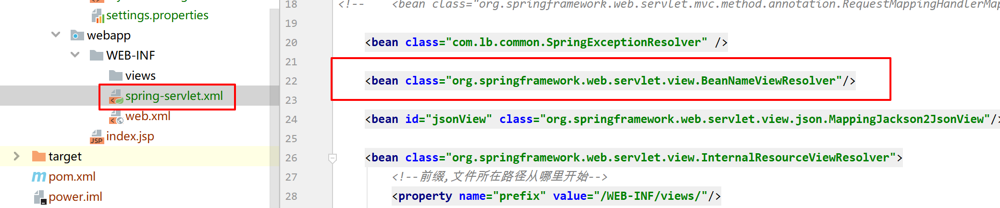

## 6-1 核心类生成-Mybatis Generator

修改generator.xml配置，改成适合自己的路径配置

逆向工程执行语句


```java
java -jar mybatis-generator-core-1.3.2.jar -configfile generator.xml -overwrite
```

执行：


生成成功：


## 6-2 项目接口定义-json,page

```java
package com.lb.common;

import lombok.Getter;
import lombok.Setter;

import java.util.HashMap;
import java.util.Map;

@Getter
@Setter
public class JsonData {

    private boolean ret;

    private String msg;

    private Object data;

    public JsonData(boolean ret) {
        this.ret = ret;
    }

    public static JsonData success(Object object, String msg) {
        JsonData jsonData = new JsonData(true);
        jsonData.data = object;
        jsonData.msg = msg;
        return jsonData;
    }

    public static JsonData success(Object object) {
        JsonData jsonData = new JsonData(true);
        jsonData.data = object;
        return jsonData;
    }

    public static JsonData success() {
        return new JsonData(true);
    }

    public static JsonData fail(String msg) {
        JsonData jsonData = new JsonData(false);
        jsonData.msg = msg;
        return jsonData;
    }

    public Map<String, Object> toMap() {
        HashMap<String, Object> result = new HashMap<String, Object>();
        result.put("ret", ret);
        result.put("msg", msg);
        result.put("data", data);
        return result;
    }
}
```

## 6-3 接口请求全局异常处理-设计与验证

自定义异常：


全局异常处理类：

```Java
package com.lb.common;

import com.lb.exception.ParamException;
import com.lb.exception.PermissionException;
import lombok.extern.slf4j.Slf4j;
import org.springframework.web.servlet.HandlerExceptionResolver;
import org.springframework.web.servlet.ModelAndView;

import javax.servlet.http.HttpServletRequest;
import javax.servlet.http.HttpServletResponse;

@Slf4j
public class SpringExceptionResolver implements HandlerExceptionResolver {

    @Override
    public ModelAndView resolveException(HttpServletRequest request, HttpServletResponse response, Object handler, Exception ex) {
        String url = request.getRequestURL().toString();
        ModelAndView mv;
        String defaultMsg = "System error";

        // 这里我们要求项目中所有请求json数据，都使用.json结尾
        if (url.endsWith(".json")) {
            if (ex instanceof PermissionException || ex instanceof ParamException) {
                JsonData result = JsonData.fail(ex.getMessage());
                mv = new ModelAndView("jsonView", result.toMap());
            } else {
                log.error("unknown json exception, url:" + url, ex);
                JsonData result = JsonData.fail(defaultMsg);
                mv = new ModelAndView("jsonView", result.toMap());
            }
        } else if (url.endsWith(".page")){ // 这里我们要求项目中所有请求page页面，都使用.page结尾
            log.error("unknown page exception, url:" + url, ex);
            JsonData result = JsonData.fail(defaultMsg);
            mv = new ModelAndView("exception", result.toMap());
        } else {
            log.error("unknow exception, url:" + url, ex);
            JsonData result = JsonData.fail(defaultMsg);
            mv = new ModelAndView("jsonView", result.toMap());
        }

        return mv;
    }
}
```

放入spring容器中：



测试类：


测试结果：


## 6-4 校验工具-BeanValidator开发

### 引入validator依赖：

```java
<!-- validator -->
<dependency>
    <groupId>javax.validation</groupId>
    <artifactId>validation-api</artifactId>
    <version>1.1.0.Final</version>
</dependency>
<dependency>
    <groupId>org.hibernate</groupId>
    <artifactId>hibernate-validator</artifactId>
    <version>5.2.4.Final</version>
</dependency>
```

引入工具类依赖：

```Java
<!-- tools -->
<dependency>
    <groupId>commons-collections</groupId>
    <artifactId>commons-collections</artifactId>
    <version>3.2.2</version>
</dependency>
<dependency>
    <groupId>commons-codec</groupId>
    <artifactId>commons-codec</artifactId>
    <version>1.10</version>
</dependency>
```

### BeanValidator类

```java
package com.lb.util;

import com.google.common.base.Preconditions;
import com.google.common.collect.Lists;
import com.google.common.collect.Maps;
import com.lb.exception.ParamException;
import org.apache.commons.collections.MapUtils;

import javax.validation.ConstraintViolation;
import javax.validation.Validation;
import javax.validation.Validator;
import javax.validation.ValidatorFactory;
import java.util.Collection;
import java.util.Collections;
import java.util.Iterator;
import java.util.LinkedHashMap;
import java.util.Map;
import java.util.Set;

public class BeanValidator {

    private static ValidatorFactory validatorFactory = Validation.buildDefaultValidatorFactory();

    public static <T> Map<String, String> validate(T t, Class... groups) {
        Validator validator = validatorFactory.getValidator();
        Set validateResult = validator.validate(t, groups);
        if (validateResult.isEmpty()) {
            return Collections.emptyMap();
        } else {
            LinkedHashMap errors = Maps.newLinkedHashMap();
            Iterator iterator = validateResult.iterator();
            while (iterator.hasNext()) {
                ConstraintViolation violation = (ConstraintViolation)iterator.next();
                errors.put(violation.getPropertyPath().toString(), violation.getMessage());
            }
            return errors;
        }
    }

    public static Map<String, String> validateList(Collection<?> collection) {
        Preconditions.checkNotNull(collection);
        Iterator iterator = collection.iterator();
        Map errors;

        do {
            if (!iterator.hasNext()) {
                return Collections.emptyMap();
            }
            Object object = iterator.next();
            errors = validate(object, new Class[0]);
        } while (errors.isEmpty());

        return errors;
    }

    public static Map<String, String> validateObject(Object first, Object... objects) {
        if (objects != null && objects.length > 0) {
            return validateList(Lists.asList(first, objects));
        } else {
            return validate(first, new Class[0]);
        }
    }

    public static void check(Object param) throws ParamException {
        Map<String, String> map = BeanValidator.validateObject(param);
        if (MapUtils.isNotEmpty(map)) {
            throw new ParamException(map.toString());
        }
    }
}
```


#### 使用 import org.apache.commons.collections.MapUtils; 判断map是否为空


测试接口：


### 测试：

不传递参数访问：<http://localhost:8081/power_war_exploded/test/validate.json>


传递参数访问：<http://localhost:8081/power_war_exploded/test/validate.json?msg=你好&id=1


## 6-5 Json转化工具-JsonMapper开发

引入依赖：

```java
<!-- jackson -->
<dependency>
    <groupId>org.codehaus.jackson</groupId>
    <artifactId>jackson-core-asl</artifactId>
    <version>1.9.13</version>
</dependency>
<dependency>
    <groupId>org.codehaus.jackson</groupId>
    <artifactId>jackson-mapper-asl</artifactId>
    <version>1.9.13</version>
</dependency>
```


```Java
package com.lb.util;

import lombok.extern.slf4j.Slf4j;
import org.codehaus.jackson.map.DeserializationConfig;
import org.codehaus.jackson.map.ObjectMapper;
import org.codehaus.jackson.map.SerializationConfig;
import org.codehaus.jackson.map.annotate.JsonSerialize;
import org.codehaus.jackson.map.ser.impl.SimpleFilterProvider;
import org.codehaus.jackson.type.TypeReference;

@Slf4j
public class JsonMapper {

    private static ObjectMapper objectMapper = new ObjectMapper();

    static {
        // config
        objectMapper.disable(DeserializationConfig.Feature.FAIL_ON_UNKNOWN_PROPERTIES);
        objectMapper.configure(SerializationConfig.Feature.FAIL_ON_EMPTY_BEANS, false);
        objectMapper.setFilters(new SimpleFilterProvider().setFailOnUnknownId(false));
        objectMapper.setSerializationInclusion(JsonSerialize.Inclusion.NON_EMPTY);
    }

    public static <T> String obj2String(T src) {
        if (src == null) {
            return null;
        }
        try {
            return src instanceof String ? (String) src : objectMapper.writeValueAsString(src);
        } catch (Exception e) {
            log.warn("parse object to String exception, error:{}", e);
            return null;
        }
    }

    public static <T> T string2Obj(String src, TypeReference<T> typeReference) {
        if (src == null || typeReference == null) {
            return null;
        }
        try {
            return (T) (typeReference.getType().equals(String.class) ? src : objectMapper.readValue(src, typeReference));
        } catch (Exception e) {
            log.warn("parse String to Object exception, String:{}, TypeReference<T>:{}, error:{}", src, typeReference.getType(), e);
            return null;
        }
    }
}
```

## 6-6 获取Spring上下文工具-ApplicationContextHelper开发

```java
package com.lb.common;

import org.springframework.beans.BeansException;
import org.springframework.context.ApplicationContext;
import org.springframework.context.ApplicationContextAware;
import org.springframework.stereotype.Component;

@Component("applicationContextHelper")
public class ApplicationContextHelper implements ApplicationContextAware {

    private static ApplicationContext applicationContext;

    public void setApplicationContext(ApplicationContext context) throws BeansException {
        applicationContext = context;
    }

    public static <T> T popBean(Class<T> clazz) {
        if (applicationContext == null) {
            return null;
        }
        return applicationContext.getBean(clazz);
    }

    public static <T> T popBean(String name, Class<T> clazz) {
        if (applicationContext == null) {
            return null;
        }
        return applicationContext.getBean(name, clazz);
    }
}
```

加入spring容器


测试：


访问：<http://localhost:8081/power_war_exploded/test/validate.json>


## 6-7 Http请求前后监听工具-HttpInterceptor开发

```java
package com.lb.common;

import com.lb.util.JsonMapper;
import lombok.extern.slf4j.Slf4j;
import org.springframework.web.servlet.ModelAndView;
import org.springframework.web.servlet.handler.HandlerInterceptorAdapter;

import javax.servlet.http.HttpServletRequest;
import javax.servlet.http.HttpServletResponse;
import java.util.Map;

@Slf4j
public class HttpInterceptor extends HandlerInterceptorAdapter {

    private static final String START_TIME = "requestStartTime";

    /**
     * 请求之前执行
     * @param request
     * @param response
     * @param handler
     * @return
     * @throws Exception
     */
    @Override
    public boolean preHandle(HttpServletRequest request, HttpServletResponse response, Object handler) throws Exception {
        String url = request.getRequestURI().toString();
        Map parameterMap = request.getParameterMap();
        log.info("request start. url:{}, params:{}", url, JsonMapper.obj2String(parameterMap));
        long start = System.currentTimeMillis();
        request.setAttribute(START_TIME, start);
        return true;
    }

    /**
     * 请求正常结束后执行,请求异常不会执行
     * @param request
     * @param response
     * @param handler
     * @param modelAndView
     * @throws Exception
     */
    @Override
    public void postHandle(HttpServletRequest request, HttpServletResponse response, Object handler, ModelAndView modelAndView) throws Exception {
        String url = request.getRequestURI().toString();
        long start = (Long) request.getAttribute(START_TIME);
        long end = System.currentTimeMillis();
        log.info("request finished. url:{}, cost:{}", url, end - start);
    }

    /**
     * 请求结束后执行，请求异常也会执行
     * @param request
     * @param response
     * @param handler
     * @param ex
     * @throws Exception
     */
    @Override
    public void afterCompletion(HttpServletRequest request, HttpServletResponse response, Object handler, Exception ex) throws Exception {
        String url = request.getRequestURI().toString();
        long start = (Long) request.getAttribute(START_TIME);
        long end = System.currentTimeMillis();
        log.info("request completed. url:{}, cost:{}", url, end - start);
    }


}

```

添加配置：

